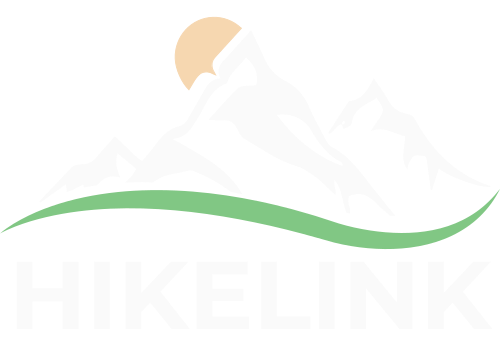

<div align="center">
  
  <h3 style="font-style: italic; margin-top: -0.25rem">Explora. Comparte. Conecta</h3>  


 
 
 <br>


</div>

---
> [!NOTE]
> ## 🌄 Descripción del Proyecto
> ### Español
> **HikeLink** es una red social especializada para amantes del senderismo que permite subir rutas ***GPX***, descubrir y valorar rutas de otros usuarios. Incluye un mapa interactivo basado en ***OpenStreetMap*** y ***Leaflet***, sistema de búsqueda avanzado, valoraciones por estrellas, comentarios y foro comunitario. Una alternativa moderna centrada en la comunidad española frente a plataformas como ***Wikiloc***.
> ### English
> **HikeLink** is a specialized social network for hiking enthusiasts that allows users to upload ***GPX*** routes, discover and rate other users' routes. It features an interactive map based on ***OpenStreetMap*** and ***Leaflet***, advanced search system, star ratings, comments, and community forum. A modern alternative focused on the Spanish community compared to platforms like ***Wikiloc***.

---

## 📚 Índice

- [📚 Índice](#-índice)
- [📁 Estructura del Proyecto](#-estructura-del-proyecto)
- [🚀 Instalación y Configuración](#-instalación-y-configuración)
  - [Requisitos Previos](#requisitos-previos)
  - [Clonar el Repositorio](#clonar-el-repositorio)
- [🛠️ Entorno de Desarrollo](#️-entorno-de-desarrollo)
  - [Configuración Inicial](#configuración-inicial)
- [🏭 Entorno de Producción](#-entorno-de-producción)
- [🌐 Acceso en Producción](#-acceso-en-producción)
- [👨‍💻 Créditos](#-créditos)
- [📄 Licencia](#-licencia)

---
## 📁 Estructura del Proyecto

```
Hikelink/
├── backend/                   # API Django + DRF
│   ├── config/                # Configuración del proyecto Django
│   ├── hikelink_app/          # Aplicación principal
│   │   ├── serializers/       # Serializadores DRF
│   │   ├── views/             # Vistas de la API
│   │   ├── templates/         # Plantillas de email
│   │   ├── utils/             # Utilidades (email)
│   │   ├── models.py          # Modelos de datos
|   |   └── populate.py        # Datos base
│   ├── media/                 # Archivos subidos por usuarios
│   └── requirements.txt       # Dependencias Python
├── frontend/                  # Aplicación Vue.js
|   ├── public/                # Imagenes y fuentes
│   ├── src/                   # Contiene los archivos de Vue
│   │   ├── components/        # Componentes Vue reutilizables
│   │   ├── views/             # Páginas de la aplicación
│   │   ├── services/          # Servicios API
│   │   ├── stores/            # Estado global (Pinia)
│   │   ├── router/            # Configuración de rutas
│   │   └── styles/            # Estilos SCSS
│   └── package.json           # Dependencias Node.js
├── docker/                    # Configuración Docker
│   ├── dev/                   # Dockerfiles desarrollo
│   └── prod/                  # Dockerfiles producción
├── docker-compose.dev.yml     # Desarrollo con Docker
├── docker-compose.prod.yml    # Producción con Docker
└── README.md                  # Este archivo
```

---

## 🚀 Instalación y Configuración

### Requisitos Previos

- **Docker** y **Docker Compose** instalados
- **Git** para clonar el repositorio

### Clonar el Repositorio

```bash
git clone https://github.com/ArmVV26/HikeLink_TFG.git
cd HikeLink_TFG
```

---

## 🛠️ Entorno de Desarrollo

Para levantar el proyecto en modo desarrollo:

```bash
# Levantar todos los servicios
docker-compose -f docker-compose.dev.yml up --build

# O en segundo plano
docker-compose -f docker-compose.dev.yml up --build -d
```

**Servicios disponibles:**
- **Frontend:** http://localhost:5173
- **Backend API:** http://localhost:8000
- **PgAdmin:** http://localhost:5050

### Configuración Inicial

1. **Crear superusuario** (opcional):
```bash
docker-compose -f docker-compose.dev.yml exec backend python manage.py createsuperuser
```

2. **Cargar datos de prueba** (opcional):
```bash
docker-compose -f docker-compose.dev.yml exec backend python manage.py runscript populate
```

---

## 🏭 Entorno de Producción

Para simular el entorno de producción localmente:

```bash
docker-compose -f docker-compose.prod.yml up --build
```

> [!WARNING] Asegúrate de tener configurados los archivos `.env` con las variables de entorno necesarias tanto en el directorio raíz como en `/frontend/`.

---

## 🌐 Acceso en Producción

La aplicación está desplegada y disponible en:

**🔗 [https://www.hikelink.es](https://www.hikelink.es)**

---

## 👨‍💻 Créditos

Este proyecto ha sido desarrollado como **Trabajo de Fin de Grado** del ciclo formativo **DAW (Desarrollo de Aplicaciones Web)** por:

**Armando Vaquero Vargas**  
IES Francisco Ayala  
Curso 2024-2025

---

## 📄 Licencia

© 2025 - Armando Vaquero Vargas. Todos los derechos reservados.

Este proyecto ha sido desarrollado exclusivamente con **fines académicos** como parte del Trabajo de Fin de Grado del ciclo formativo DAW.